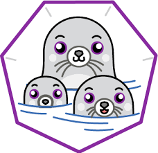

<h1 align="center">
<br>Containerization</br>
  <a href="https://www.docker.com/">
    
  </a>
  <a href="https://podman.io/">
     
  </a>
</h1>

[](https://github.com/barbacbd/predictor-dev-image/actions/workflows/docker-image.yml)

The project contains the instructions for creating the [docker](https://www.docker.com/) or [podman](https://podman.io/) development image and running the container instance of the image. The development image allows users to create a development environment in a container for software development purposes. 

**Note**: _Podman and Docker can be used interchangeably throughout this document, unless specified otherwise_.

**Note**: _Please modify the script and alter all personal details when utilizing the script for personal development_.

# Initialization


```bash
./CreateDockerfile.sh
```

The script listed [above](./CreateDockerfile.sh) will build a Dockerfile and create the image. The Dockerfile is removed
at the end of the script, if it was created. At the conclusion of the script, the user will be prompted with a similar
line to the one below.


```bash
podman run -it predictor-dev:latest /bin/bash
```

This line/command can and should be used to enter the container through bash.


_If you wish to call your image something other than `predictor-dev`, change the name `predictor-dev` in the script_.


# Checking the image

You may check that your image was created with:

```bash
podman image ls
```

You _should_ receive an output such as:

```bash
REPOSITORY                          TAG          IMAGE ID      CREATED        SIZE
localhost/predictor-dev             latest       8eaeb0d43eed  2 days ago     3.18 GB
```

If your output looks similar to below, then your image was **not** created successfully. If/When this occurs, please look carefully at
the log during image creation and report any issues.

```bash
REPOSITORY                          TAG          IMAGE ID      CREATED        SIZE
<none>                              <none>       9989387fbb3e  3 weeks ago    395 MB
```

# Passing data to the container

```bash
podman run -it --privileged -v ${PWD}/predictor_output:/predictor_output predictor:latest /bin/bash
```

This will execute the container and enter you into the container. _Any file(s) that you wish to share between the host and container should be
added to the directory that you created_.


**Note**: _You only need to add `--privileged` when using [podman](https://podman.io/) as the permissions are handled differently between podman and docker_.
